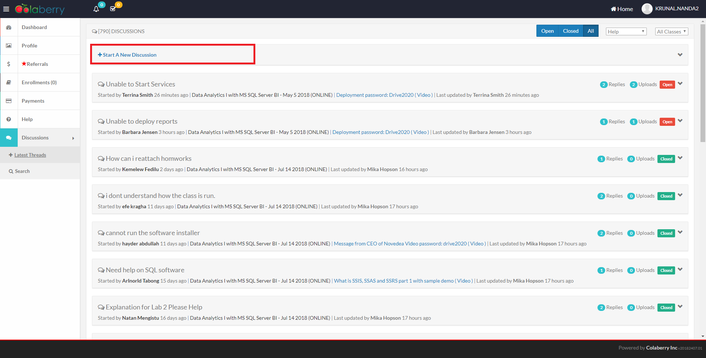
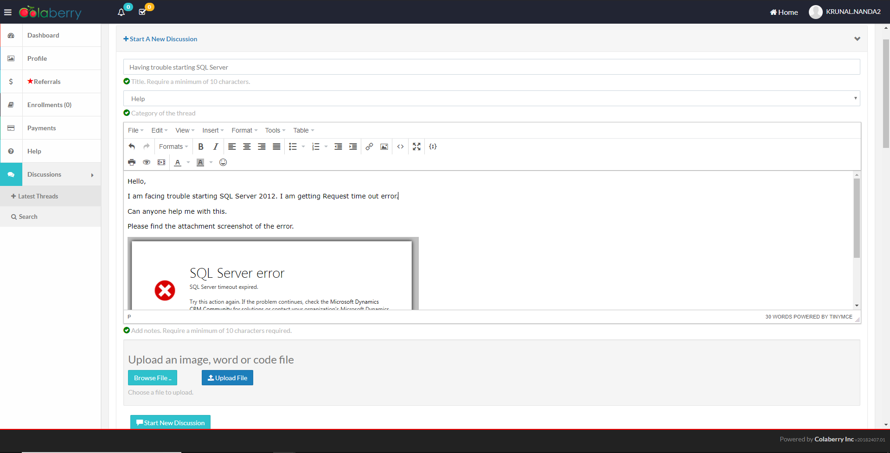

## Add a new discussion

> Following steps will help you on how to add a new discussion.

### Access Discussion Page

Login to the application

Visit `Discussions` in the left Navigation Bar. Click on `Latest Threads`

Click `Start A New Discussion`

### Fill the Form

:exclamation: Provide all the required information

> You can paste screenshot in the editor or can upload using `Browse File` > Select File > Click `Upload`

### Click `Start New Discussion`

