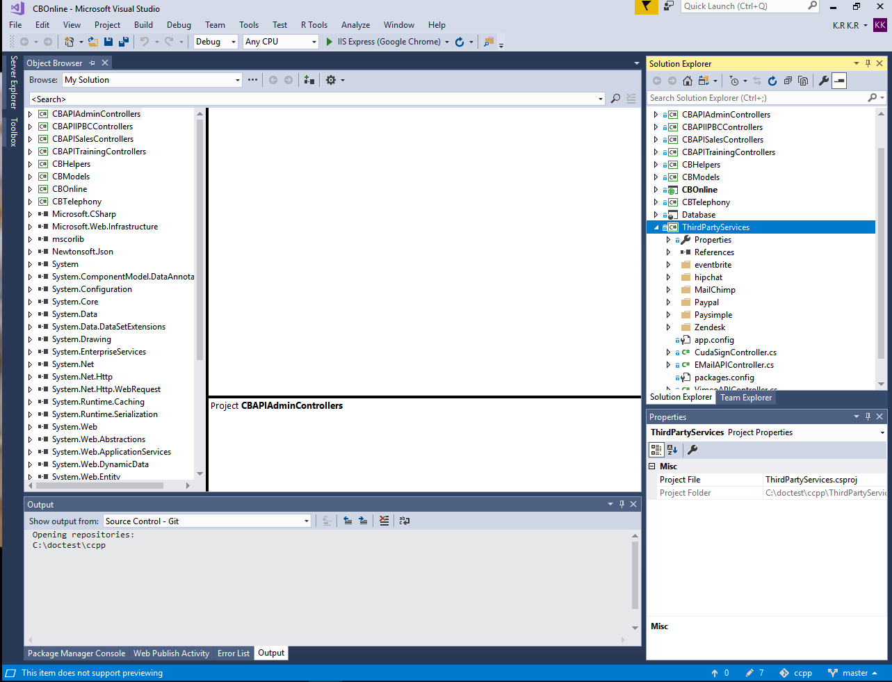
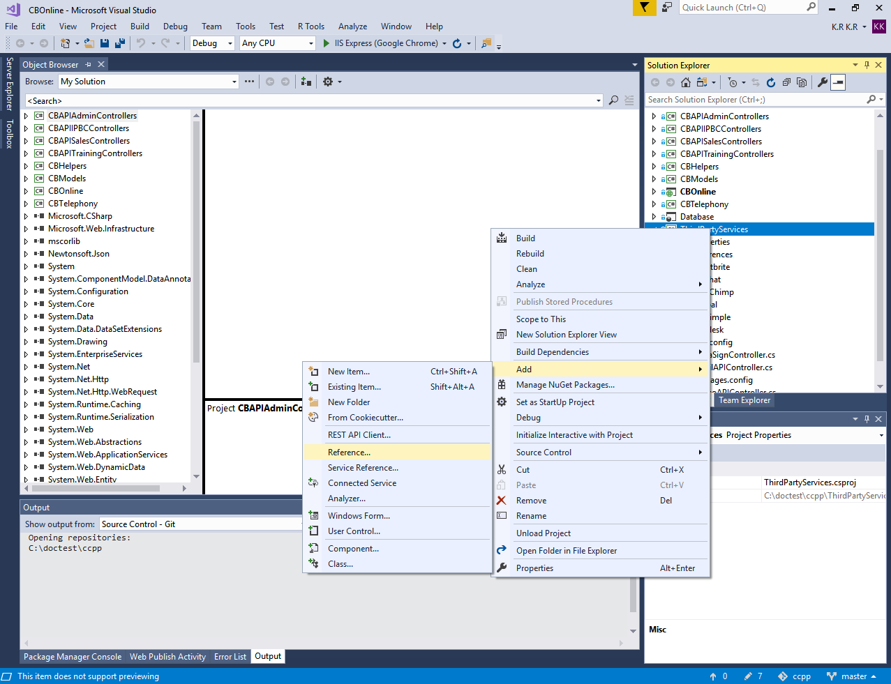
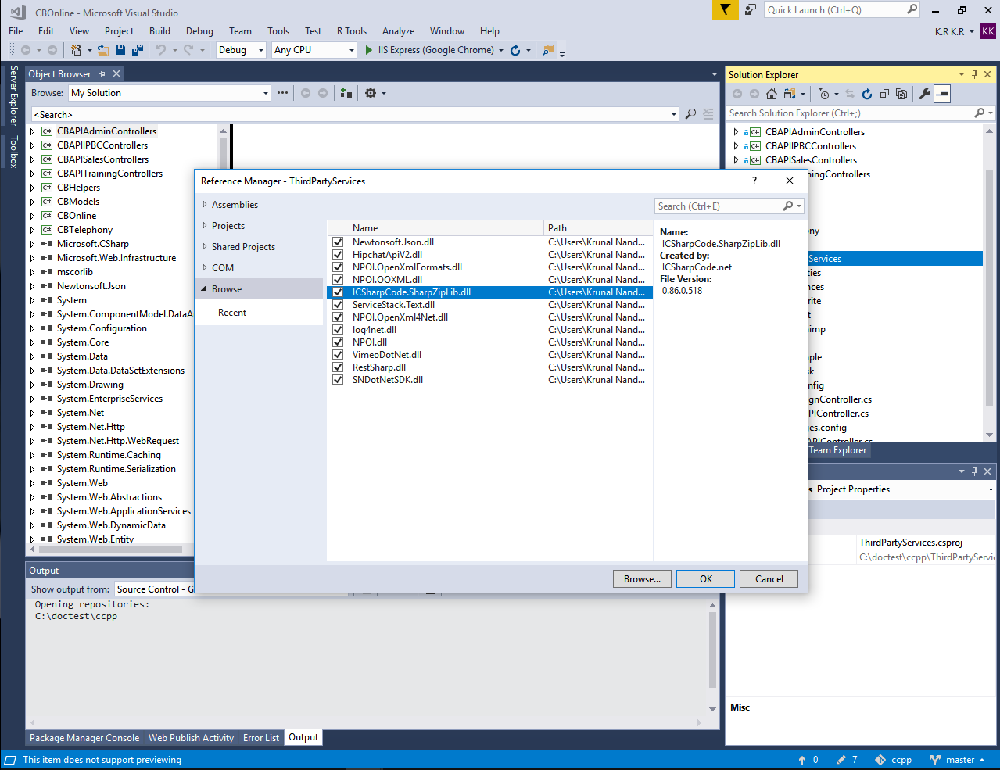
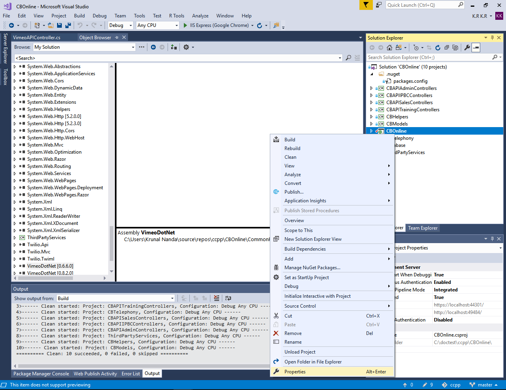
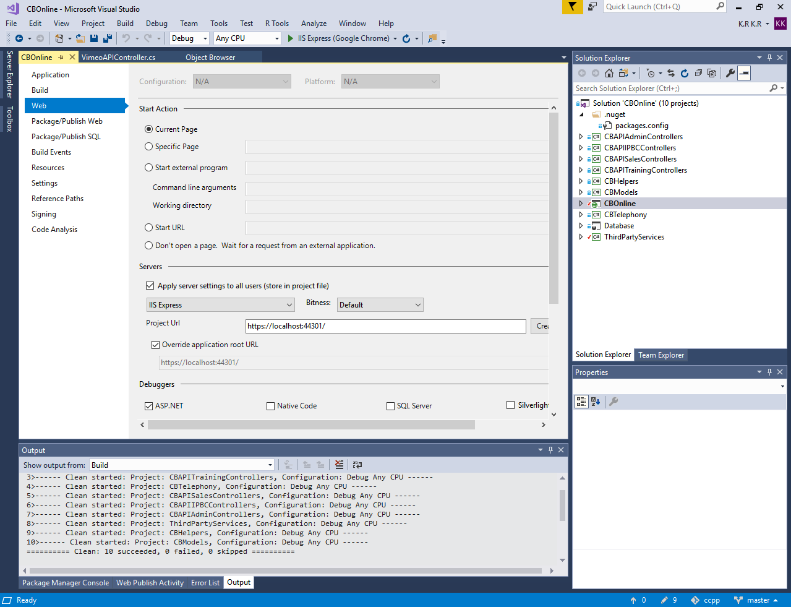

## Setup Environment on a Local Machine

> Following are the steps to setup Colaberry App on Local Machine for development.

### Install Visual Studio

Before you begin check if your computer supports the system requirements for [Visual Studio 2017](https://docs.microsoft.com/en-us/visualstudio/productinfo/vs2017-system-requirements-vs)

### Clone Github Repository

Clone the github repository of the colaberry private repository ccpp using the following command.

```
git clone <ccpp repository>
```

Double click on the CBOnline.sln to open it in `Visual Studio`

### Download some Common Reference Libraries and Web.config from the production server.
:exclamation: Make sure you change Database connection string in Web.config to local database.

You will need both Web.config from solution directory and Views folder.

> The name 'ViewBag' does not exist in the current context

This error occurs because of missing `web.config` from Views folder.

Right Click `ThirdPartyServices` > `Add` > `Reference`






Add `libraries` from Common References




Right Click `CBOnline` > `Properties` > `Web`




Make sure you set Url as `https://localhost:44301` > Create `Virtual Directory` 




Run `IIS Express`
