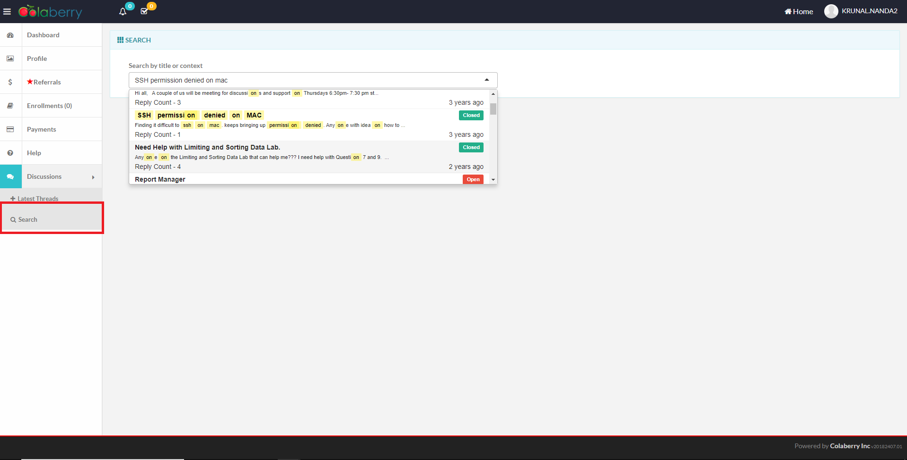
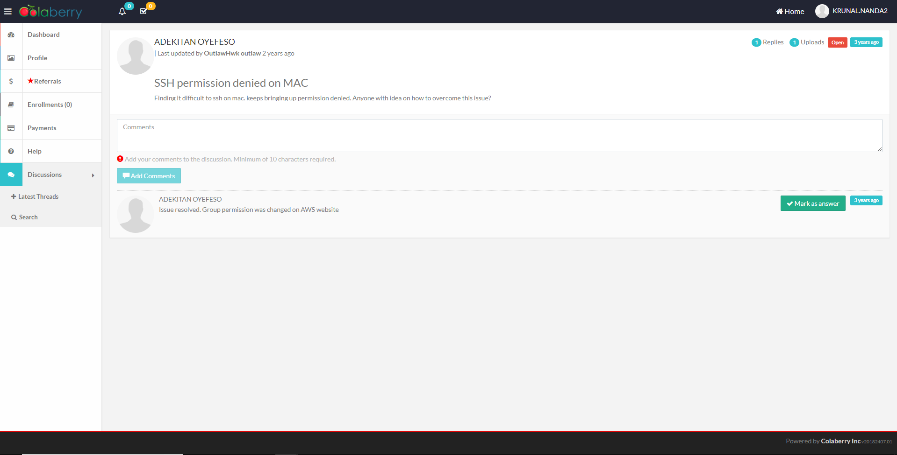

## Search a Discussion

> Follow the following steps to search for a discussion.

## Access Search Discussion

Login to the application

Visit `Discussions` in the left Navigation Bar. Click on `Search`

## Search

Type into the textbox using the keywords.

> The application will search on basis of title and content of particular discussion.

The system will auto populate the discussions based on search keywords.

Click on the discussion. It will redirect to the Discussion details page.

